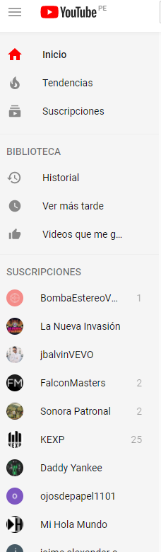
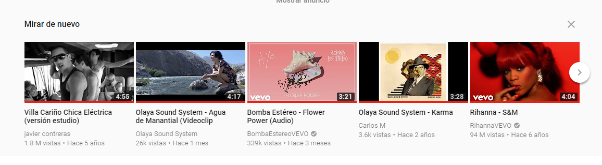
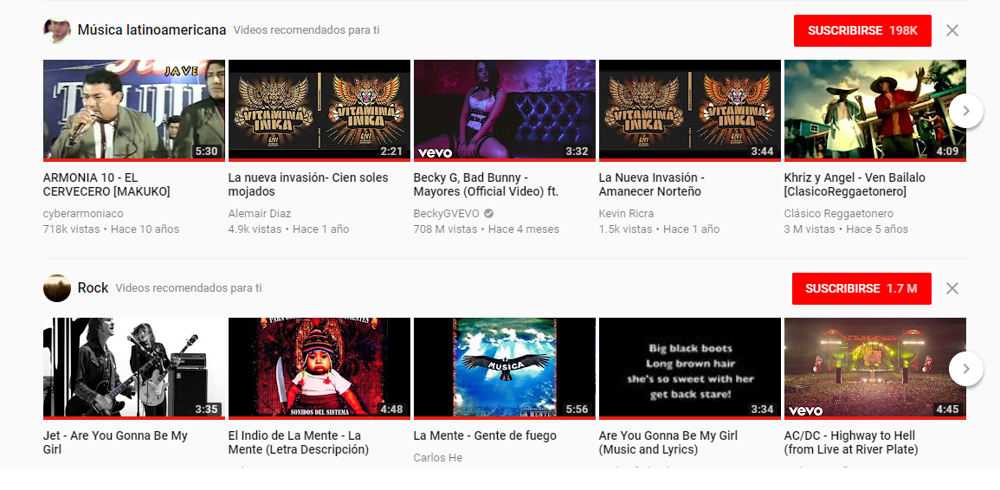
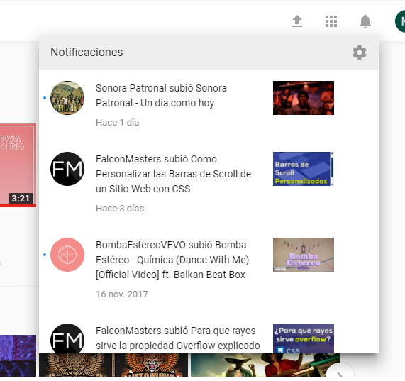
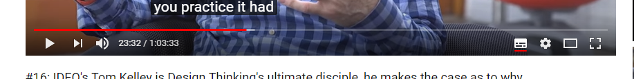
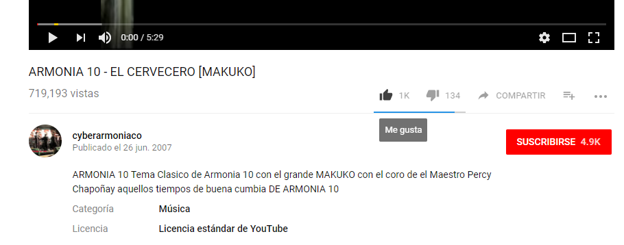
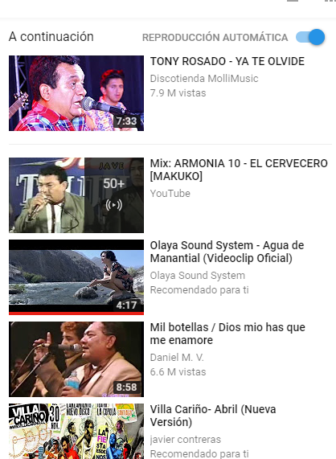
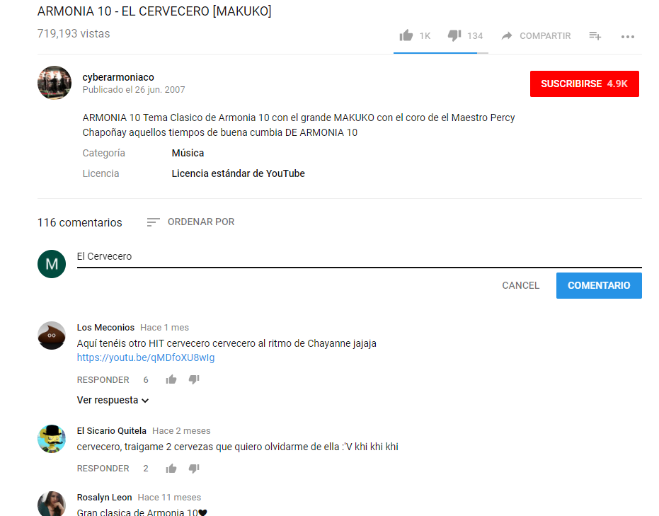

# RETO 1

***

Explica qué partes conforman el UX y qué partes el UI de la página web Youtube

## YOUTUBE

### UX

* En la página de inicio:

  1. Contamos con una barra vertical, donde podemos ir directamente a nuestra biblioteca (los videos favoritos, guardados par a ver luego), nuestras suscripciones

  

  2. Nos muestra un espacio para mirar de nuevo los videos.

  

  3. Nos muestra recomendaciones de videos referentes a mi historial; poder ver los videos donde los hemos dejado; para poder visualizarlos luego; nos muestra un miz de canciones, de acuerdo a nuestro historial y/o género musical de nuestra preferencia

  

  4. Me muestran las notificaciones, referente a lo nuevo de los caneles a los que me encuentro suscrito

  

* Visualizando un video

  1. Nos muestra una barra, que nos indica cuánto vamos viendo del video, nos permite pausar, adelantar, dar el volumen, repetir el video; además nos indica el nombre y el canal a donde pertenece el video, el número de visualizaciones, la cantidad de me gusta y no me gusta, además de la fecha en la que fue subida

  

  2. Nos da opciones de configuración para el video, que nos permite cambiar la calidad, dar subtítulos, ver el video según el tamaño que desee

  

  3. Nos permite agrega a favoritos al video, suscribirse a otros canales, compartir el video en la red social de mi preferencia

  

  4. Nos muestra una barra vetical, donde me muestra los videos que estarán acontinuación, referentes (sugerencias) al video que estoy visualizando

  

  5. Me permite dar un comentario referente al video que he visializado, a las vez ver los demás comentario, y poder comentar y/o responder esos comentarios

  

* Como canal propio

  1. Nos permite tener un canal propio.
  2. Podemos subir y compartir videos propios.
  3. Difunfir nuestros videos
